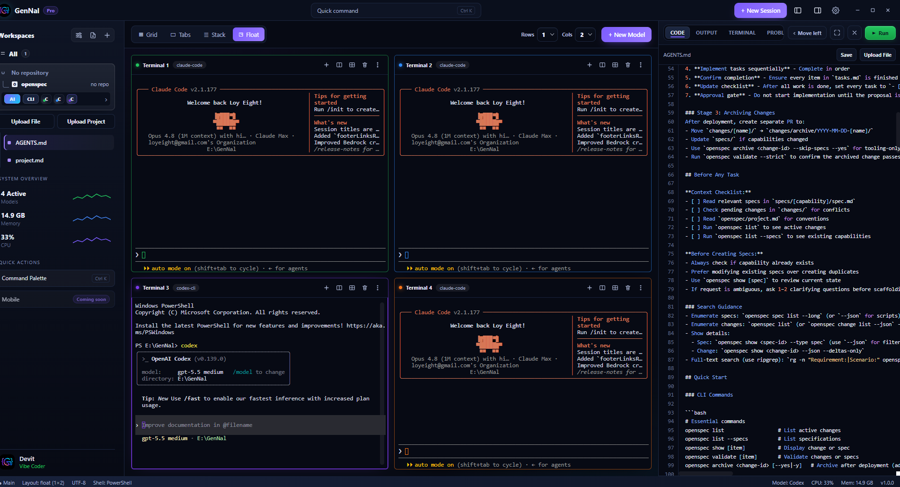
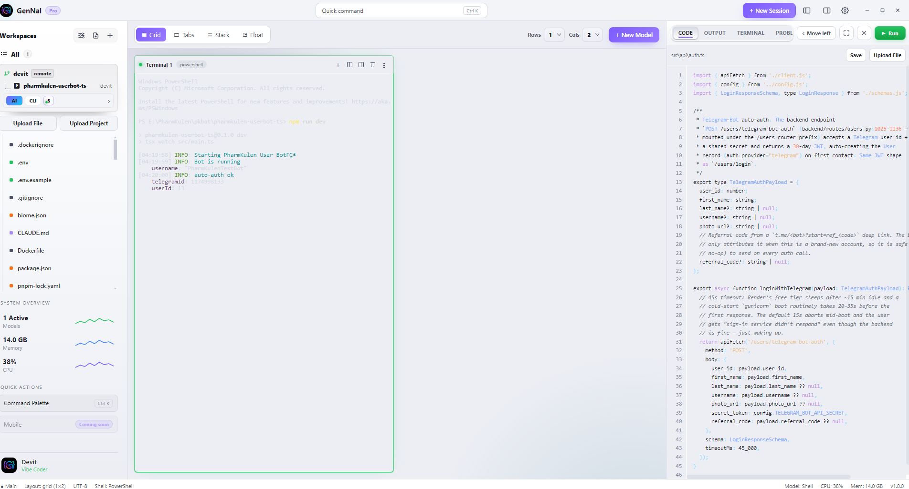
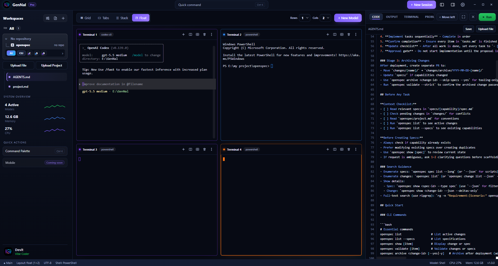
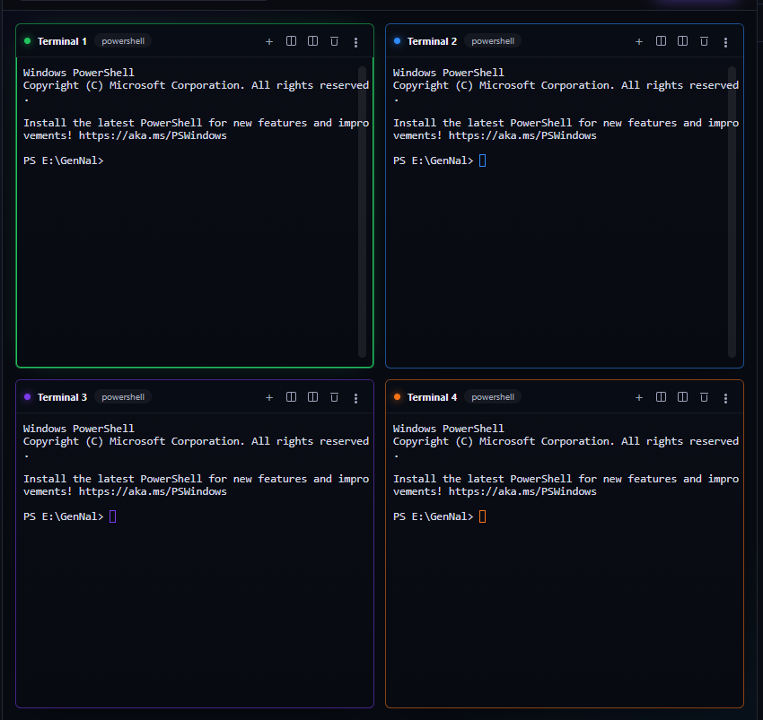

# GenNal — Multi-Model AI Cockpit

A desktop app to **launch, run, and manage Codex, Claude & Gemini simultaneously**,
each in its own live terminal pane, with a shared code view and an AI assistant panel.
Runs on **Windows** and **macOS**.

 



## Screenshots

| Code editor + live terminal | Multi-pane float layout |
| --- | --- |
|  |  |

Grid of model terminals running side by side:



## Download & Install

Grab the latest installer from the [**Releases**](https://github.com/Gen-Group/GenNal/releases/latest) page.

### Windows

1. Download **`GenNal-Setup-1.0.4.exe`** from the latest release.
2. Run it and follow the prompts (you can choose the install location).
3. Launch **GenNal** from the Start Menu or desktop shortcut.

> The installer is currently unsigned, so Windows SmartScreen may warn you.
> Click **More info → Run anyway** to continue.

### macOS

> ⚠️ A prebuilt macOS `.dmg` is **not** attached to the release. macOS apps can only be
> packaged on a Mac (the native `node-pty` module and `.dmg`/`.app` bundling are
> macOS-only and cannot be produced on Windows), so you build it locally on a Mac.

On a Mac with [Node.js 20+](https://nodejs.org) and `git`:

```bash
git clone https://github.com/Gen-Group/GenNal.git
cd GenNal
bash mac/install.sh      # builds GenNal and installs GenNal.app into /Applications
```

This also produces `GenNal-1.0.4-arm64.dmg` (Apple Silicon) and `GenNal-1.0.4-x64.dmg`
(Intel) in `dist/`. See [`mac/README.md`](mac/README.md) for the full guide.

The build is unsigned, so on first launch **right-click GenNal → Open → Open**
(or run `xattr -cr /Applications/GenNal.app` once). `mac/install.sh` clears this for you.

## Quick start (dev)

```powershell
cd E:\GenNal
npm install            # installs deps
npm run dev            # launch the app with hot reload
```

> `node-pty` 1.0 ships **N-API prebuilt binaries** (`prebuilds/win32-x64`), so no compiler
> is needed — verified booting on this machine. Only if you ever hit a native load error on
> an unusual arch should you run `npm run rebuild` (that path needs Visual Studio C++ build
> tools: "Desktop development with C++").

## Build the installers

**Windows** (run on Windows):

```powershell
npm run dist:win       # → dist/GenNal-Setup-1.0.4.exe  (NSIS installer)
```

Then publish it on the website:

```powershell
Copy-Item dist\GenNal-Setup-1.0.4.exe website\downloads\GenNal-Setup.exe
```

**macOS** (must run on a Mac — native `node-pty` and `.dmg` packaging are macOS-only):

```bash
npm run dist:mac       # → dist/GenNal-1.0.4-arm64.dmg and dist/GenNal-1.0.4-x64.dmg
```

## What it does

- **Model launcher** — `+ New Session` / `+ New Model` spawns Claude, Codex, Gemini, or a
  plain shell in a new pane. Models are defined in `models.json` (data, not code).
- **Live panes** — each pane is a real PTY (PowerShell) running the model's CLI, with full
  color, interactive prompts, restart, and close.
- **Layouts** — Grid (Rows×Cols), Tabs, Stack, Float via the toolbar / bottom dock.
- **Sidebar** — workspaces, live model-session list with status dots, and a System Overview
  (active models, memory, CPU) fed by live `systeminformation` stats.
- **Right panel** — a code view (CODE/OUTPUT/TERMINAL/PROBLEMS) + the GenNal AI assistant UI.
- **Command palette** — `Ctrl+K` to launch models / switch layouts.

## Architecture

- **Main** (`src/main`): `BrowserWindow` (frameless), `pty-manager` (node-pty),
  `model-registry`, `stats-service`, IPC.
- **Preload** (`src/preload`): typed `window.api` over `contextBridge` —
  `contextIsolation: true`, `nodeIntegration: false`.
- **Renderer** (`src/renderer`): React + Zustand + xterm.js.

See `PLAN.md` for the full build plan and phase status, and `website/README.md` for the
download site.

## Adding a model

Edit `models.json` (or drop a `models.json` in the app's userData dir to override):

```json
{ "id": "aider", "label": "Aider", "tag": "aider-cli", "command": "aider", "accent": "#34d399" }
```
